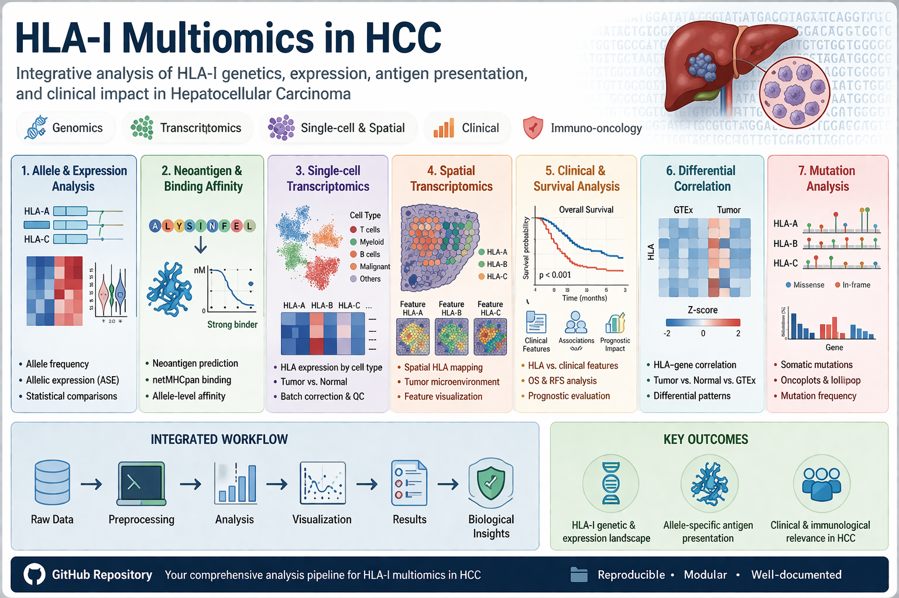

# HLA-I Multiomics Analysis in HCC



## 📄 Associated Manuscript

This repository contains the analysis code for the study:

**"HLA Class I Expression and Ratios as Diagnostic and Predictive Biomarkers in Hepatocellular Carcinoma: A Multi-Omics Study"**

🟡 Currently under publication in *Heliyon*.

---

## 🌐 Live Resource

An interactive version of this analysis will be available here:

👉 (Coming soon)

---

## 📁 Project Structure

```
HLA-I-Multiomics-HCC/
├── README.md
├── LICENSE
├── doc/
│   └── header.png
├── data/
│   ├── bulk_RNA_seq/
│   ├── differential_correlation/
│   ├── genotype_allele_specific_expression/
│   ├── model/
│   ├── mutation/
│   ├── neoantigen/
│   ├── scrna/
│   └── spatial_transcriptomics/
├── results/
└── scripts/
```

---

## ⚠️ Data Availability

Due to file size and licensing restrictions, datasets are NOT included.

Users must download them manually:

### Bulk expression:
https://xenabrowser.net/datapages/?dataset=TcgaTargetGtex_rsem_gene_tpm&host=https://toil.xenahubs.net

### scRNA-seq & spatial:
http://lifeome.net:809/#/download

---

## ▶️ How to Run

```r
setwd("path/to/HLA-I-Multiomics-HCC")
source("scripts/01_allele_frequency.R")
```

---

## 🧬 Pipeline Overview

1. Allele frequency
2. Allele expression
3. Neoantigen affinity
4. Clinical analysis
5. Correlation analysis
6. Machine learning
7. Mutation analysis
8. Single-cell & spatial

---

## 🧪 Neoantigen Analysis (netMHCpan)

Run generated shell scripts:

```bash
bash Code-Linux-HLA-A.sh
bash Code-Linux-HLA-B.sh
bash Code-Linux-HLA-C.sh
```

Move outputs to:
```
results/neoantigen/A
results/neoantigen/B
results/neoantigen/C
```

---

## 📚 Citation

If you use this repository, please cite:

Aliyari S. et al. *Heliyon* (in press)

---

## 🧑‍💻 Author

Shahram Aliyari  
Bioinformatics Researcher
